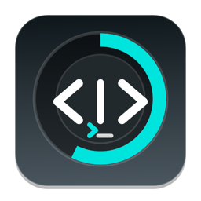
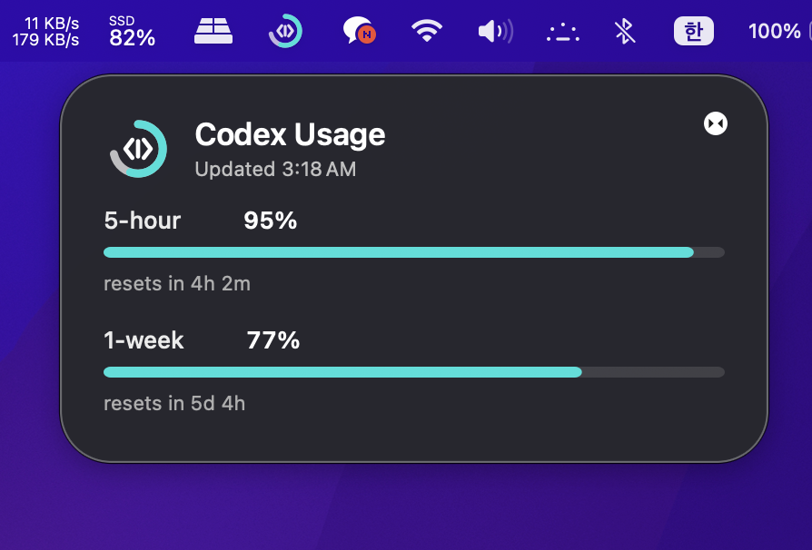
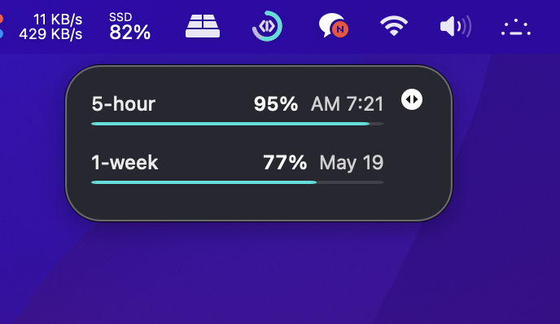

<div align="center">



# Codex Usage

macOS menu bar app that shows the remaining Codex quota from the local Codex app.

</div>

## Screenshots

| Full panel | Compact panel |
| --- | --- |
|  |  |

The panels float above normal windows, can be dragged, and show the 1-week quota first with the 5-hour quota as secondary context.

## Behavior

- The menu bar icon shows a 1-week remaining quota gauge. It intentionally does not show percent text.
- Left-click toggles the floating quota panel.
- Right-click opens actions for the floating panel, refresh, activating Codex, and quit.
- Both floating panels stay above normal windows and can be dragged.
- The full and compact panels show the 1-week quota first, with 5-hour quota as secondary context.
- The app does not store OpenAI credentials, cookies, API keys, or session tokens.
- The app only launches the Codex app's bundled command after verifying OpenAI's Developer Team ID.

## Data Source

Codex Usage reads usage through the Codex app's bundled local app-server:

```text
codex app-server --listen stdio://
account/rateLimits/read
```

It uses Codex's own authenticated local command path and only parses the returned rate-limit JSON. It does not use OCR, screen capture, Accessibility scraping, cookies, or direct token file reads. The Codex app-server may contact OpenAI to read the current quota; Codex Usage itself does not make direct network requests.

For best results:

1. Keep Codex installed and signed in.
2. Use `Refresh Usage` in the menu bar app.

## Development

Run tests from the repository root:

```bash
swift test
```

Run the executable directly:

```bash
swift run CodexUsage
```

## Build App Bundle

```bash
./Scripts/build_app.sh
```

The bundle is written to:

```text
.build/Codex Usage.app
```

The local bundle is ad-hoc signed and verified so Info.plist and resources are sealed for local testing. It is not notarized and is not the final public release artifact.

## Build Distribution DMG

For a real public release, set a Developer ID identity and a stored notary profile:

```bash
export DEVELOPER_ID_APPLICATION="Developer ID Application: Your Name (TEAMID)"
export NOTARY_PROFILE="notary-profile"
./Scripts/package_dmg.sh
```

The release DMG is written to:

```text
.build/dist/Codex Usage.dmg
```

For local packaging tests only, unsigned DMG creation is explicit:

```bash
ALLOW_UNSIGNED=1 SKIP_NOTARIZE=1 ./Scripts/package_dmg.sh
```

## Permissions

No Accessibility or Screen Recording permission is required for the app-server data source.

## Security Model

- Trust boundary: Codex Usage trusts only a Codex app bundle whose bundle identifier matches Codex and whose code signature has OpenAI's Developer Team ID.
- Process execution: it starts Codex's bundled `codex` executable with `app-server --listen stdio://` and sends JSON-RPC over stdio.
- Environment: the child process receives a minimal environment (`HOME`, `USER`, `LOGNAME`, `TMPDIR`, and system `PATH`) so shell-specific secrets are not forwarded.
- Data retention: the app stores only the floating panel frame in `UserDefaults`. It does not store quota history or account data.
- Output handling: app-server stdout and stderr buffers are capped to reduce risk from unexpected or malformed output.

## Public Distribution Notes

The local development bundle is ad-hoc signed and intended for personal testing only. Do not upload `.build/Codex Usage.app` or an `ALLOW_UNSIGNED=1` DMG as the public release artifact. Before sharing the app broadly:

1. Sign the app with a Developer ID Application certificate.
2. Enable the hardened runtime for notarization.
3. Notarize and staple the distributed app or disk image.
4. Build a universal binary if Intel Mac support is intended.
5. Package the app in a signed and notarized `.dmg` or `.zip`.
6. Keep a clear privacy note: the app starts Codex's local app-server over stdio, reads rate-limit JSON, and does not store credentials or usage history.

Codex's local app-server is an internal/experimental dependency. Codex updates may change or remove `account/rateLimits/read`, so public releases should explain that compatibility depends on the installed Codex app version.

Mac App Store distribution is not a good fit for the current architecture because the app depends on launching and communicating with another locally installed app's bundled command. Direct distribution with Developer ID notarization is the intended path.
